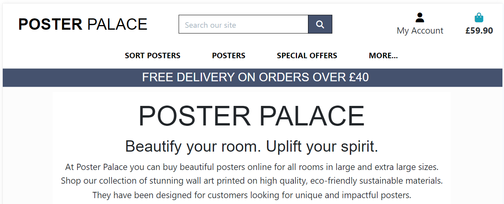
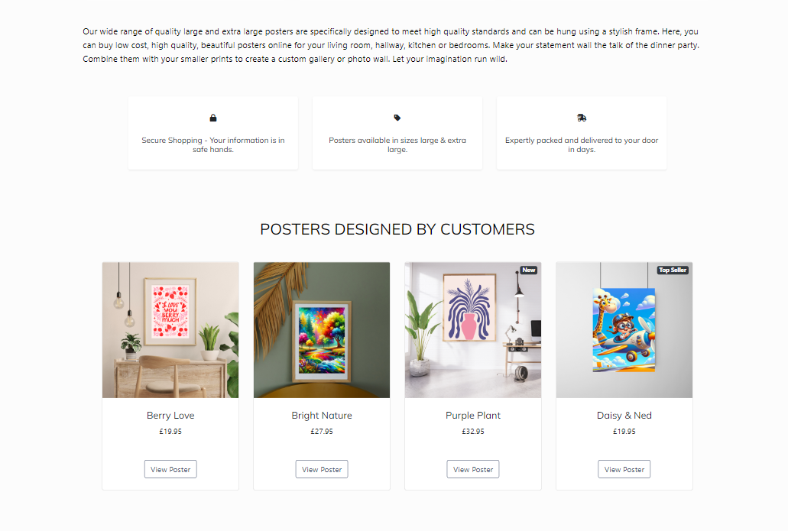
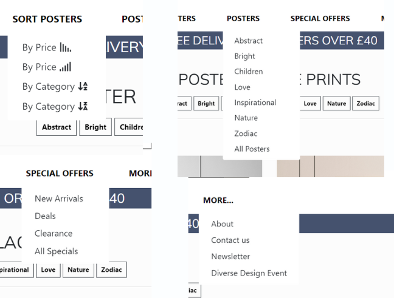
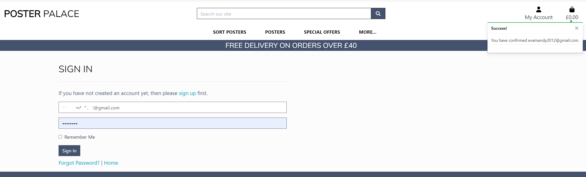
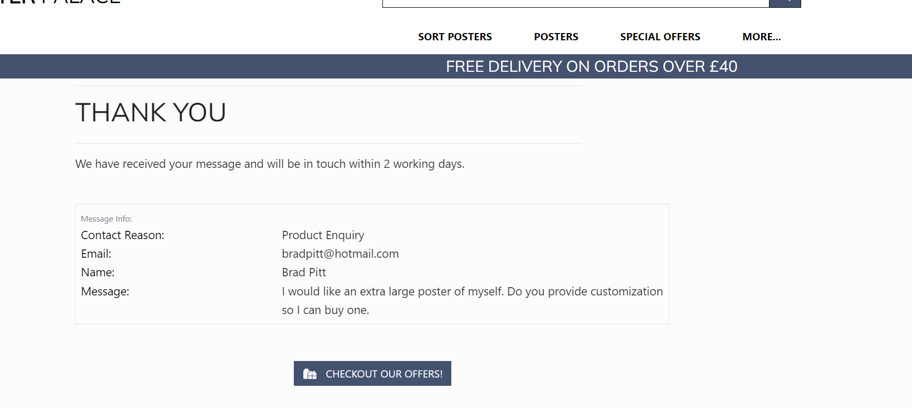
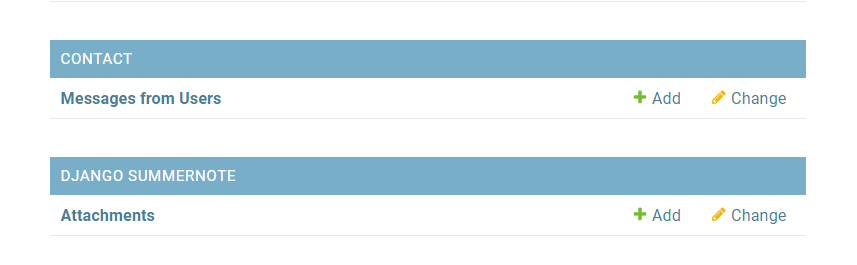
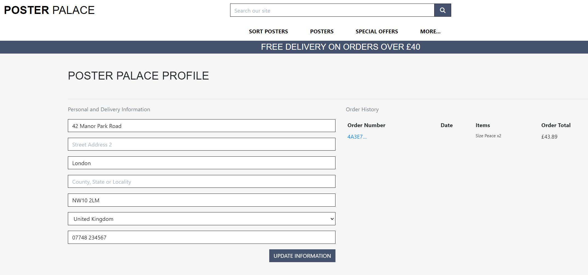
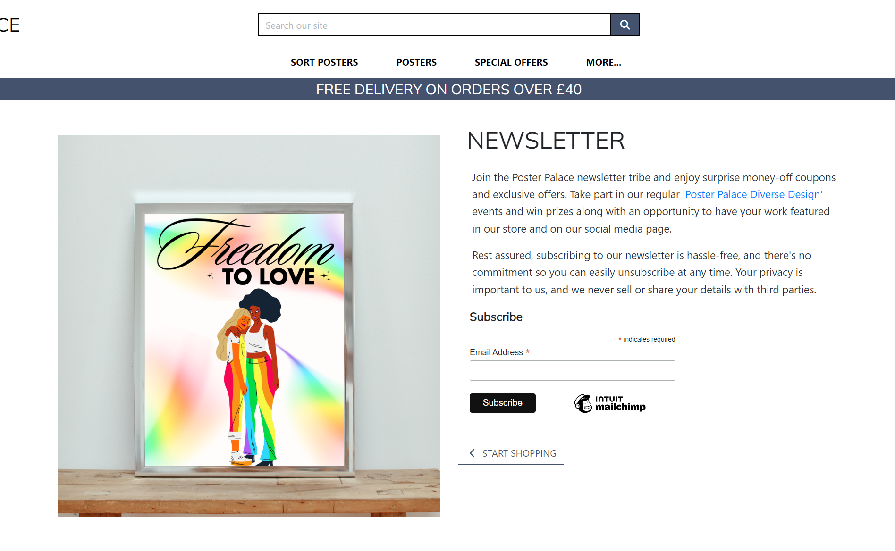

## Table of Content

[Overview](#overview)

+ [Project Rationale](#project-Rationale)

+ [Project Objectives and Outcomes](#project-objectives-and-outcomes)

+ [Target Audience](#target-audience)

[Model Views Template (mvt)](#model-views-template-mvt)

+ [Agile Terminologies](#agile-terminologies)

[Database Structure](#database-structure)

[Site Structure](#site-structure)

Home App

+ [User features and design](#user-features-and-design)

+ [Epics and user stories](#epics-and-user-stories)
    + [Epics](#epics)
    + [Admin](#admin)
    + [User](#user)

+ [Authentication and Authorisation](#authentication-and-authorisation)

    +[Emails](#emails)

+ [Navigation](#navigation)

+ [Products](#Products)

+ [Product Menu](#Product Menu)

+ Shopping Cart / Bag App

+ [Checkout App](#Checkout App)


+ [Reviews](#reviews)


+ [User Profiles](#user-profile)

+ [Site Colours and Font](#site-colours-and-font)

[CRUD Functionality](#crud-functionality)

ONLINE MARKETING - marketing app

Keywords and Meta

Social Media

Web content

Newsletter

Diverse Design Competition

[Future Implementations](#future-implementations)

[Testing](#testing)

[Deployment](#deployment)

[Technologies Used](#technologies-used)

[Resources Used](#resources-used)

[Acknowledgements](#acknowledgements)

[Retrospective](#retrospective)


# Project Overview

Poster Palace - Beautify your room. Uplift your spirit.

The place to buy large (61 x 91 cm or 24.02 x 35.83 inches) and extra large (80 x 120 cm or 31.50 x 47.24 inches) posters to beautify your room and uplift your spirit. These high quality, designer inspired posters are statement pieces meant for display on a large statement wall. They have been designed for customers looking for unique and impactful wall art.

The site is [DEPLOYED HERE](https://posterpalace-a7414f135cf3.herokuapp.com/)

Admin Panel is [DEPLOYED HERE](https://posterpalace-a7414f135cf3.herokuapp.com/admin)

To "purchase" products/test checkout using fake credit card details you can use:

Card number : 4242 4242 4242 4242

Expires     : 04 / 26

CVV         : 242

Zip         : 42424


<br>

# Project Rationale

The development of an ecommerce store specialising in large and extra-large posters has been driven by several clear rationales:

<details>

**Market Demand**
While there are a number of sites offering wall art in a large range of sizes, there are very few offering larger sizes in wall art making it an underserved market. The platform also embraces a niche focus catering to customers searching for larger sized posters, providing an opportunity to differentiate from competitors and attract customers looking for a specialised product.

**Target Audience:**
Niche products attract a niche target audience. High quality attracts people willing to pay for luxury products. The large and extra-large sizes of these posters along with the printing quality means our product will attract a specific demographic including interior designers, business owners looking for wall art for their office or individuals with large homes looking for statement pieces to enhance their living space and aesthetics and of any room. 

Potential buyers include:

- Interior designers, landlords or homeowners who want posters to decorate their property.

- Office business owners looking for statement wall pieces or large pieces of art for their office and/or boardroom

- Retail business owners looking for large pieces of wall art to display in their shop or cafe.

- Travel enthusiasts, music lovers, sports enthusiasts, art admirers, etc. who might be interested in purchasing niche poster designs.

- Parents looking to decorate their child’s room with a statement piece.

<br>

**Print Quality and Materials**
Posters will be produced using high-quality printing techniques and materials making them durable and long-lasting. Our commitment to quality will build brand trust with customers and support with any community engagement plans.

 **Online Shopping Trends:**
With the convenience of e-commerce we are leveraging the growing trend of online shopping. Customers can easily browse and purchase posters from the comfort of their homes, making it important that the website  is user-friendly and optimised for online transactions and engagement.

**Global Reach:**
The posters can be shipped internationally, providing an opportunity for the business to reach a broader audience and tap into markets beyond our immediate location.

**Customisation Options**
Customisation is an extremely popular and growing trend in online shopping. While customisation isn’t currently available on the platform there is the potential to offer this option, providing a more personalised touch and a unique selling point.
We can not only offer the chance for customers to customise using words but also using their own images.

</details>
<br>

# Project Objectives

The objective of this project is to build a Full-Stack eCommerce site with payment system and product structure based on business logic used to control a centrally-owned dataset.

As well as employing advanced User Experience Design to build this Full-Stack web application, search engine optimisation (SEO) and social media marketing techniques have been used in the delivery of content and images (e.g. the name of the image on the about page is “buy-posters-online”) to improve audience and brand reach. Objectives include:

<details>

**Develop a Comprehensive Product Catalog**
Design an appealing selection of posters in a variety of different areas, e.g. nature, zodiac, children etc.

**Implement Robust eCommerce Technology** 
Use Django as a reliable eCommerce platform that supports product listing and apps that support shopping cart management, checkout processes, and customer account management.

**Role-Based Access Control (RBAC)**
Implement RBAC to define and manage the roles of users. Superusers will have elevated privileges, including direct access to the admin area and data store. Non-admin users e.g. buyers will have the ability to use the site, update their profile and leave reviews but will not have direct access to the admin area.

**Ensure Mobile Responsiveness and Accessibility**
A mobile-first approach is taken to ensure the store is accessible and user-friendly on various devices, including smartphones and tablets.

**Integrate Stripe Secure Payment Gateway**: 
Incorporate Stripe as a trusted payment solution to facilitate secure and convenient transactions for buyers and prompt payment of funds to the owner.

**Set Up Customer Support System** 
Implement customer service solutions, including FAQs and email support, to assist customers effectively.

**Compliance and Legal Considerations**
Ensure the store complies with relevant laws and regulations, including data protection, terms and conditions, privacy policy and intellectual property rights.

**Optimize for Search Engines (SEO)**
Ensure the website, images and product pages are optimised for search engines to increase visibility and attract organic traffic. Writing optimised web content is important.

**Establish Effective Digital Marketing Strategies**
Digital marketing techniques such as social media marketing, email campaigns, and content marketing will be implemented to attract and retain customers. Ensuring above the fold content management.

**Create a Community Engagement Plan**
Develop strategies to engage with customers and create a community around the brand, such as through social media, competitions, and newsletters.
</details>
<br>

# Project Outcomes

The above objectives outline what I wanted to complete when creating this project, which led to the creation of the following outcomes (achieved results):

<details>

**Functional eCommerce Platform**
A fully operational online store with a relational database that allows users to browse, select, and purchase posters to be delivered to their homes. The fully responsive platform will provide a wide range of products for sale and will be managed using role-based access to control the flow of information and ensure data is secure.

**Secure Site Registration**
Authentication mechanism deployed that lets users register and login so that their order details and address can be saved for future reference. All users must go through the confirmation of their email address before being allowed to log-in. The ability for users to buy products anonymously is also available if they prefer to do so.

**User-Friendly Interface**
An intuitive and easy-to-navigate website that provides a seamless shopping experience for customers. Includes the ability to search for products and to add potential products to a wishlist.

**Secure Payment Processing**
Using Stripe payment as a reliable and secure system for handling transactions, protecting customer data, and ensuring privacy.

**Effective Delivery Management**
Efficient delivery of products to customers within the stated delivery times.

**Customer Support Management**
Ability for customers to gain support with their order and/or use of the site, e.g. registration and logging in. Support is also available for non-registered users to get in touch.

**Customer Engagement and Retention**: 
Strong online presence via social media and SEO. A store that attracts customers via its activity and also encourages repeat business and customer loyalty.

</details>

<br>

# Model View Template

I used MVT to help define the project's requirements, features, and structure by considering the following questions:

<details>

## Model (Database Design)

**Authentication and role-based Authorisation:** How will we include authentication and role-based authorisation in our data model? What information will we request and store?

**Admin Area:** How will we ensure only authorised users have access to this information and what will be included?

**Product Information:** What attributes will each product have? (e.g., name, price, description, category, delivery, quantity etc.)

**Buyer Accounts:** What information will we store about our customers? (e.g., name, email, password, address, telephone number, purchase history etc)

**Order Management:** How will we track orders? What information is needed for each order? (e.g., customer details, order status, payment information etc)

**Inventory Management:** Will we need to manage an inventory for physical products or rely on print-on-demand?

**Security Management:** How will we store and manage customer information in our database? What security measures will be in place to prevent unauthorised access or distribution?

**Wish List, Reviews and Ratings:** What will we include in our system for customer feedback on products? How will authorised users be able to save products while browsing?

## Views (User Interface)

**Product Browsing:** How will products be displayed and organised for easy browsing? (e.g., categories, filters, search functionality)

**Wish List, Reviews and Ratings:** What information will customers be able to save and review? What will they see and how will it be managed.

**Product Pages:** What information will be displayed on individual product pages? (e.g., images, descriptions, price, reviews)

**Shopping Cart:** How will the shopping cart function? What information will be displayed in the cart?

**Checkout Process:** What steps will the user go through during checkout? (e.g., address input, payment method selection). Will anonymous checkout be included?

**User Account Management:** How will registered users view and manage their accounts? (e.g., view purchase history, update personal information)

**Responsive Design:** Will the design be responsive to different devices (mobile, tablet, desktop)?

## Templates (Front-End Design)

**Branding:** How will the store's branding be incorporated into the design?

**Navigation:** How will users navigate through the site? (e.g., menu layout, footer links etc)

**Consistency:** How will we ensure a consistent look and feel across different pages?

**Customisation:** How easily can templates be customised for special promotions or changes in/additions to product?

## Authorisation and Security

**User Authentication:** How will users log in and manage their accounts? What security measures will be in place for password protection?

**Payment Processing:** How will we handle payment authorisation securely? Will we use a third-party payment gateway?

**Access Control:** How will we control access to different parts of the site (e.g., admin panel)?

**Data Protection:** How will we protect user data, especially sensitive information like addresses and payment details?

**Compliance:** How will we handle consent management?  Are there any legal compliance issues to consider, such as GDPR for European customers?

## Additional Considerations

**SEO Optimisation and Marketing:** How will we optimise product pages and web content for search engines?

**Analytics and Reporting:** How will we track and analyse user behaviour, sales trends, etc.?

**Customer Support:** How will customer inquiries and issues be handled?

**Marketing and Promotions:** How will we market our products and manage promotions?

</details>
<br>

# Using Agile Terminologies

My aim throughout this project was to focus my working time using agile terminologies:

•	Create backlog

•	Divide work into sprints

•	Create subset sprints

•	Review work - completed yesterday, to do today, any challenges

•	Testing - developer tool, (print) command, keep an eye on terminal/console area.

•	Obtain feedback.

•	Maintain product backlog and prioritise items/adapt to change.

•	Future implementations/scalability and performance optimisation.

User stories were created and the GitHub project area was used to manage this process.
You can see the [Poster Palace Project Process here.](https://github.com/users/todiane/projects/10)

The sprint was divided into three sections:

<details>

| First Sprint | Second Sprint | Final Sprint |
| ------------ | ------------- | ------------ |
| Balsamiq wireframes created | Products designed and added| Add additional pages e.g. Shipping, privacy policy, Terms and other pages created, 404, 500, sitemap, cookie banner etc |
|Project Structure considered | Views and templates working – checks and tested | Fix any bugs and further testing using Dev tools|
| Database model ideas created and tested. | Payment system setup with emails | Creation of README |
| Django apps created – models and views added | UX and UI design decided and implemented | Submit for Peer to Peer review |
| Templates set up to accommodate models and views | Code refactoring takes place if needed | Final overview before submission |
| Initial Deployment to Heroku | Users added to test site using fake credit card details | Ensure DEBUG set to False |
| SEO & Marketing created.  | Full site is manually tested. Email set up tested. | Project Submission. Drink wine! |

</details>
<br>

# Database Structure

This database schema defines the structure and relationships for this store. I used business logic in the design of the database by ensuring there are clear relationships between each model - e.g. User, Products, Wishlist, Buyer Profile etc. There is a method to count reviews and ratings, to add users, to allow users to buy products and edit and update their information etc.

Once users register a file is created that stores their username and password plus any additional information provided. Users are then allocated a profile and have the ability to add products to their wishlist and purchase products. 

<details>

I created the database structure using [dbdiagram.io](https://dbdiagram.io/d) and django-dbml. After installing django-dbml and adding it to my list of apps in the settings file, I ran the command

```python manage.py dbml``

And was given a list of my database schema that I could then add to dbdiagram.io

```
Table About {
  id: big_auto [pk, unique]
  title: char
  subtitle: char [null]
  image: image
  updated_on: date_time
  content: text
  Note: '''About(id, title, subtitle, image, updated_on, content)'''
}
Table Category {
  id: big_auto [pk, unique]
  name: char
  slug: slug [null, unique]
  friendly_name: char [null]
  Note: '''Model to create product categories'''
}
Table Product {
  id big_auto [pk, unique]
  sku char [null, default:`django.utils.crypto.get_random_string()`]
  name char
  slug slug [unique]
  image image [null]
  description text
  sizes boolean [null, default:`False`]
  price decimal [default:`9.95`]
  category foreign_key [null]
  available boolean [default:`True`]
  created date_time
  updated date_time
  Note: '''Model to add products'''
}
ref: Product.category > Category.id
 
Table Reviews {
  id big_auto [pk, unique]
  product foreign_key
  user foreign_key
  subject char
  review text
  rating float
  ip char
  status boolean [default:`True`]
  created_at date_time
  updated_at date_time
  Note: '''Model for buyer reviews'''
}
ref: Reviews.product > Product.id
ref: Reviews.user > User.id
 
 
Table Order {
  id big_auto [pk, unique]
  order_number char
  buyer_profile foreign_key [null]
  full_name char
  email email
  phone_number char
  street_address1 char
  street_address2 char [null]
  town_or_city char
  county char [null]
  postcode char [null]
  country None [default:`"GB"`]
  created date_time
  updated date_time
  delivery_cost decimal [default:`0`]
  order_total decimal [default:`0`]
  grand_total decimal [default:`0`]
  original_bag text [default:`""`]
  stripe_pid char [default:`""`]
  Note: '''Model to create orders and profiles'''
}
ref: Order.buyer_profile > BuyerProfile.id
 
Table OrderLineItem {
  id big_auto [pk, unique]
  order foreign_key
  product foreign_key
  product_size char [null]
  quantity integer [default:`0`]
  lineitem_total decimal
  Note: '''OrderLineItem(id, order, product, product_size, quantity, lineitem_total)'''
}
ref: OrderLineItem.order > Order.id
ref: OrderLineItem.product > Product.id

Table BuyerProfile {
  id big_auto [pk, unique]
  user one_to_one [unique]
  default_street_address1 char [null]
  default_street_address2 char [null]
  default_town_or_city char [null]
  default_county char [null]
  default_postcode char [null]
  default_country None [null]
  default_phone_number char [null]
  Note: '''Buyer profile to maintain order/delivery history'''
}
ref: BuyerProfile.user - User.id
 
 
Table Contact {
  id big_auto [pk, unique]
  contact_purpose char
  email email
  name char
  phone char [null]
  message text
  date_submitted date_time
  Note: ''' Contact Us form for visitors and customers'''
}
 
 
Table WishList {
  id big_auto [pk, unique]
  user_id foreign_key
  product_id foreign_key
  date_added date_time
  Note: '''User can start a wishlist'''
}
ref: WishList.user_id > User.id
ref: WishList.product_id > Product.id
 ```
 

The site contains a usable database that stores data in a consistent and well-organised manner. Postresql was used to create the data structure which is hosted at ElephantSQL.

Below is the visual relationship diagram for Poster Palace:

<br><br>

</details>

<br>

# Site Structure

When designing the structure of the store I kept my focus on the need to create a mobile first web-based application that has both a user interface (front end) and server-side logic database (back end) stored in a central location. My focus influenced my prototypes which are shown as wireframes below:

<details>


</details>

<br>

# Site Navigation

Poster Palace contains the follow apps:

 - Home
    - Homepage - Navigation and Footer
    - Registration
    - New password
    - About Us

- Contact app
  - Contact us

- Products app
  - Products
  - Reviews
  - Compliance

- Bag app
  - Shopping trolley

- Checkout app
  - Stripe Checkout

- Profile app
  - User Profile

- Wish List app
  - Wish list page

- Marketing app
  - Newsletter Page
  - Diverse Design Event

<br>

<details>

## Homepage 

The name of the site with a short introduction and an action button to visit our products is the first thing new and returning visitors see when they land on the homepage. The navbar highlights the search opportunities and a message bar promotes free shipping with orders over £40.

<br><br>

The latest products are listed next and display the last three recently added posters.

 <br><br>

Recent products are followed by a short paragraph containing keywords that outlines what is available on the site. The section under that explains that we ship quickly and can be trusted and the final section of the homepage displays posters designed by competition winners.

  <br><br>

Within a few seconds of landing on the site the pop up newsletter banner appears at the right hand side of the screen inviting the visitor to sign up. 

 <br><br>

This newsletter has been set to appear every 3 days of a person visiting. If this was a live store the paid subscription to MailChimp would be used and once a person signed up they would not see the invite to register again.

## Navigation and Footer

The navigation bar has designed to provide a user with multi ways to search for and find products. The first section is SORT POSTERS where users can sort according to price (ascending and decending) and category (a-z and z-a). 

The second section lets users sort posters according to their category name.

 <br><br>

The third section shows special offers available on posters.

<br><br>

The final area of the navbar provides links to pages like about us, contact us, newsletter and events page.

<br><br>


The footer at the end of the page includes links to various parts of the website as well as to the social media pages set up for the site.

<br><br>

## Registration

A link to registration is available on the checkout page but also in the menu bar

<br><br>

A message will be displayed if an error is made during registration

<br><br>

Once registered a success message is shown and the user is told to check their email for a verification link.

<br><br>

A [temp email service](https://temp-mail.org/) was used for demonstration purposes:

<br><br>


Once that link is clicked and the email confirmed the user is redirected to the sign in form and can then log in.

<br><br>

After logging in users are shown a success message.

<br><br>


## Footer

The footer area contains links to important pages on the website including compliance and to the main pages visitors use on a website - about us, contact us. A link to the newsletter is also included as an easy way for anyone who might have missed or ignored the pop out to consider registering.

<br><br>

## New Password

Once registered, if a user clicks on the forgot password link they are taken to a page where they can enter their email address. An email is sent and a link provided to reset their password. Once complete they are then able to log in.

<br><br>

<br><br>

<br><br>

<br><br>


## About Us

The about us page has been set up using a model/view/template approach and access to update the about us page is available in the admin area. It uses the same format as the product display page and features an image on the left with optimised web content on the right.

<br><br>


## Contact us app

The contact us app includes a model with user choices. They can select why they are getting in touch and then leave a message.

<br><br>


If a user is registered they do not have to include their email address as we have that information logged.

<br><br>

An unregistered user will include their email address

<br><br>

After sending the message a receipt of the message they sent appears on the screen and an invitation to visit the latest offers page.

<br><br>


Messages are sent to the admin area. 

<br><br>

<br><br>


## Products app

The products app includes a model/view to display all products on the page. Users can use the search bar to sort products into different categories.

<br><br>

Once a product has been selected users are provided with details including an image, description, price, options to select sizes, the category it belongs to and a review rating.

<br><br>

Attempts were made to change the price according to size using ProductVariation in Django but this was unsuccessful at the first attempt. I have added this to the future implementations section as something to attempt again as I learn more.

### Ratings and Reviews 

The ratings and reviews section is included on each individual product. Once a review has been added a success message is shown

<br><br>

<br><br>

In the future the reviews form will only be shown to customers who purchase a product OR a verified purchase star will appear next to the name of people who have purchased the product.


### Compliance
Compliance has been included as views/templates in the products app. These are pages to important information that needs to be included on an ecommerce store. The pages are

Terms Of Service Policy

<br><br>

Shipping Policy

<br><br>

Returns and Refund Policy

<br><br>

Privacy Policy

<br><br>

Additional pages included under compliance are for the management of errors include

403 Forbidden Page

<br><br>

404 Link Error Page

<br><br>

500 Server Error Page

<br><br>

PHOTO OF EACH PAGE

## Bag App

This app contains the model/view/template for the shopping trolley where products are kept until a customer is ready to checkout. Everytime a product is added a confirmation message appears

<br><br>

PHOTO OF SHOPPING CART


## Checkout App

The checkout page includes a form that outlines all the information needed for the order to be processed including asking for credit card details. A message in red indicates the total amount and on the right is a summary of the products being purchased.

<br><br>

The user has an option to save their details to their profile.

Checkout is possible without registration. A message has been added before the payment area inviting people to register.

<br><br>

Once complete a success message appears along with a summary of the order which is also sent via email. A copy of the email with order is also sent to Poster Palace. The superuser can then log into Stripe for full details and to fulfill the order.

<br><br>

<br><br>


## Profile app

If a buyer has registered before placing their order a copy of the order is saved in the profile area. This is also the place where a buyer can update their personal details

<br><br>

<br><br>


## Wish List app

The wish list app includes a model/view/template only available to registered users. Users can save their favourite products to this area. The image and a brief description appears on the page encouraging them to click and then select their size before adding it to their cart. Users can delete any item on their wish list

<br><br>

<br><br>

If an unregistered user clicks on the "Add to wish list" button they are automatically re-directed to the sign in page and asked to sign in before they can save a poster to the wish list.


## Marketing App

This is an area managed by superusers to promote brand awareness. Included is a page to the newsletter and a page to a regular event. This event encourages people to register for the newsletter to get information on the next event. 

<br><br>

The event is a poster competition held 4 times a year. Newsletter subscribers are invited to design and submit a poster. They can submit a poster as an individual or as a team. The winner posters are sold on the website. As well as a link to a pdf that shows the winning entries (the link can be shared around social media) the page also highlights previous winners and the posters that are available for sale on the website. Terms and conditions of entry are included.

<br><br>

</details>

## Online Marketing

While the newsletter and events page are two ways that are used to promote the website and new products, there are also two social media pages. Pinterest is popular with people looking for design ideas so along with a Facebook page, a Pinterest page was also created.


[Poster Palace Facebook Page](https://www.facebook.com/profile.php?id=61555270165633)

<br><br>


<br>

[Poster Palace Pinterest Page](https://www.pinterest.co.uk/poster_palace/ )

<br><br>

Community engagement takes place using the event, not only during promotion of the competition (when competitors are encouraged to share their ideas to gain votes) but also once the competition has finished where a shareable pdf is included.

## Search Engine Optimisation

Web content on the site has been written to meet search engine best practices including adding keywords that reflect what potential customers are using when they search online. 

Keywords have been entered into the meta area on the base.html page

The main keywords for this store are:

- buy posters online
- quality wall art
- affordable wall art
- affordable posters
- high quality posters
- large posters
- extra large posters

Open Graph meta tags were also used so the title and description of the site appears on social media if the link is shared.

These keywords are weaved into the fabric of any web content written for the site and into naming the images. Two types of poster that the store wants to focus on promoting heavily includes

- inspirational posters (posters with inspirational images and/or words)

- abstract art (popular with interior designers and offices)


<br>

# Epics and User Stories

Based on the MVT model above, the following EPICS were created

- Store Creation

- User Registration

- Products and Product Management

- Admin/Superuser Management

- SEO/Online Marketing


User stories were added to these epics and you can read the acceptance criteria and tasks completed via my [GitHub Project Page](https://github.com/users/todiane/projects/10/views/1)

<details>

**Store Creation**

- As a super user I can design and update the homepage so that I can keep it updated with the latest products.

- As a first-time visitor, I can understand what the site offers immediately so that I can decide if it meets my needs.

- As a mobile user, I want the site to be easy to navigate on my phone so that I can shop conveniently from anywhere.

**User Registration**

- As a user I can register for and manage my account so that I can start a wish list, add reviews and keep a record of any purchases

- As a user I can request a password reset via email so that I can reset my password if I have forgotten it.

**Products and Product Management**

- As a user I want to preview product details so that I can make an informed buying decision.

- As a user, I can use an effective search function so that I can find specific types of product or category quickly.

- As a buyer I can gain access to a secure payment process so I can confidently buy products.

- As a user, I want my personal and payment information to be secure so that I can trust the site with my data.

- As a buyer I receive email confirmation after purchase so I can keep track of my orders.

- As a buyer, I can leave reviews for products I’ve purchased so that I can share my experience with others.


**Admin Management**

- As superuser I want the ability to upload, edit and delete products so that I can manage the stock effectively.

- As Superuser I can track sales and customer feedback plus receive funds from Stripe.

- As a user and superuser I can read compliance information so that I understand how the company operates.


**SEO/Online Marketing**

- As a user I can subscribe to the newsletter so I can receive exclusive content.

- As the superuser, I can create and promote monthly events so that brand awareness is achieved.

- As a superuser, I can stay connected via social media so I can build a community and brand awareness.

- As a superuser, I want to add and update keywords and meta data so that I can use them on pages and in web content for SEO.

<br><br>


</details>


<br>

# UX AND UI Design

As always with my projects, the design was developed with minimalism in mind. Colours were kept to a minimum. The main structure/look of the store was taken from the Code Institute Boutique Ado project.

The font used is a Google Font called Mulish and the main colour of the store is #45526e which is a very dark desaturated blue. The background colour is a very light grey to allow for the card information to be more prominent #fcfcfc

Having worked in online marketing, digital marketing and search engine optimisation for several years I am familiar with the concepts needed to promote a website, however UX and UI design are still fairly new to me. Further research was undertaken on UX AND UI principles, not only what was taught on the course but also via my own reading. 

<details>

This led to some key considerations being considered when designing the store including:

## User Experience (UX) Design:

**User Research:** Understand the target audience, their needs, and behaviours. Conduct usability testing.

**Information Architecture:** Content organised in a logical and intuitive manner with clear navigation paths for users and instant notification of changes using toast messages.

**Wireframing:** Wireframes created to outline the layout and structure before building.

**Usability Testing:** Store was tested by users to identify potential issues. Any feedback given was used to improve user experience. e.g. Being told the font in some areas was too small.

**Accessibility:** Ensure the store is accessible to all users and follow [web content accessibility guidelines (WCAG)](https://www.w3.org/WAI/fundamentals/components/).

**Consistency:** A unified experience across different pages was implemented along with maintaining consistency in design elements so all pages look and feel the same.

**Feedback and Error Handling:** Clear feedback provided once a user takes action e.g. adds or deletes a review. Error messages provided that guide users to a solution, e.g. 404.html error page takes users back to products or homepage.

**User Journey Mapping:** A clear pathway was created from the moment a user lands on the homepage until they checkout. That includes email messages sent for authorisation and any sent once products have been purchased or if a user requests a password change.


## User Interface (UI) Design:

**Visual Hierarchy:** A clear visual hierarchy is in place that guides users through the content. Important elements of the store are highlighted using images, size, colour and placement. Above-the-fold marketing was implemented on the home page.

**Typography:** A readable and accessible font has been used, consistency maintained, and attention has been paid to font size and line spacing.

**Colour Scheme:** One main colour has been used throughout to align with the brand. Colour accessibility was considered when adding colour to templates.

**Imagery, Icons and Whitespace:** High quality designs were used for images of posters and font awesome icons were added to break up content. Whitespace was used to enhance readability and avoid visual clutter.

**Responsive Design:** The site is fully responsive and works well on different screen sizes.

**Consistent Branding:** Brand identity has been maintained throughout the site and included in all information, e.g. the PDF created to highlight the [winners of a competition](https://www.canva.com/design/DAF3uqhD65Y/iSDvZb0f6r-yHmMw7Z8hBg/view) included the same colour as the website. 

**Scalability:** I considered how UI will adapt to changes in content or functionality and designed with scalability in mind.

</details>

<br>

## Future Implementations

With scalability in mind, I have considered some elements that will be introduced in the future including:

<details>

- Only verified purchases can leave a review. At the moment the review section is available for all registered users. 
Only unauthorised users can not leave a review. However, to further enhance the review process an update is needed so 
only customers who have purchased a product and are verified buyers can leave a review.

- Price variations will be added so large and extra large sizes are given their own price per product.

- When saving to the wish list an option will be included so that users are able to select the size they want as well 
as the product and an add to cart button will be included.

- Analytical data will be collected. The ability to follow a user’s journey on the site and have data for where they 
visit the most, whether shopping carts have been abandoned, what keywords led a customer to the site, page 
optimisation and load times plus a host of other data is needed for the success of any website or store.

- Monitor and Analyze Performance. Analytics tools will be used to track website traffic, sales data, 
customer behavior, and other key performance indicators (KPIs).

- A blog app will be added to help with the community engagement plan and for search engine optimisation purposes.

- Customisation will be provided. The ability to let customers add words to posters or use their own images.


</details>


<br>

## Testing

Please see my separate [Testing MD page HERE](/TESTING.md) that includes information on testing, viability and bugs.

## Deployment


Deployment took place soon after installing Django, ElephantSQL and Cloudinary.
<br>
<details>

#### Installing libraries

The following steps outline all libraries needed for successful deployment on Heroku. All neccessary-requirements and settings updates will not be discussed in this section as they are assumed as logical follow-up steps to installments. For a full explanation of how to install these libraries, refer to the links provided in [Technologies Used](#technologies-used).

- Install **Gunicorn** (server used to run Django on Heroku): ``pip3 install django gunicorn``
- Install **pyscopg2** (connects to PostgreSQL): ``pip 3 install dj_database_url pyscopg2``
- Install **Cloudinary** (host static files and images): ``pip3 install dj3-Cloudinary-storage``


#### Create a PostgreSQL database using ElephantSQL

This is necessary to create a database that can be accessed by Heroku. The database provided by Django can not be accessed by the deployed Heroku app.

- Log into ElephantSQL and go to Dashboard
- Click **Create New Instance**
- Set up a plan by providing a Name (project name) and select a Plan (for this project the free plan "Tiny Turtle" was chosen). Tags are optional.
- Click **Select Region** and choose appropriate Datacenter
- Click **Review**, check all details and click **Create Instance**
- Return to Dashboard on click on the name of the newly created instance
- Copy the database URL from the details section

#### Hiding sensitive information

- Create ``env.py`` file and ensure it is included in the ``.gitignore`` file
- Add ``import os`` to env.py file and set environment variable **DATABASE_URL** to the URL copied from ElephantSQL (``os.environ["DATABASE_URL"]="<copiedURL>"``)
- Below, set **SECRET_KEY** variable (``os.environ["SECRET_KEY"]="mysecretkey"``, but create a more secure password.)


#### Update Settings

- Add the following code at the top of ``settings.py`` to connect the Django project to env.py:
    ````
      import os
      import dj_database_url
      if os.path.isfile('env.py'):
          import env
    ````
- Remove the insecure secret key provided by Django in settings.py and refer to a variable in env.py instead (``SECRET_KEY = os.environ.get('SECRET_KEY')``)

- To connect to the new database, replace the provided **DATABASE** variable with 
    ````
    DATABASES = {
    'default': dj_database_url.parse(os.environ.get("DATABASE_URL"))
    }
    ````
- Save and migrate all changes made


#### Connect to Cloudinary

- In the Cloudinary dashboard, copy **API Environment variable**
- In ``env.py`` file, add new variable ``os.environ["CLOUDINARY_URL"] = "<copied_variable"`` and remove ``CLOUDINARY_URL=`` from the variable string
- Add same variable value as new Heroku config var named **CLOUDINARY_URL**
- In ``settings.py``, in ``INSTALLED_APPS`` list, above ``django.contrib.staticfiles`` add ``cloudinary_storage``, below add ``cloudinary``
- To define Cloudinary as static file storage add the following to settings.py
    ````
    STATICFILES_STORAGE = 'cloudinary_storage.storage.StaticHashedCloudinaryStorage'

    DEFAULT_FILE_STORAGE = 'cloudinary_storage.storage.MediaCloudinaryStorage'
    ````

#### Allow Heroku as host

- In ``settings.py`` add
    ````
    ALLOWED_HOSTS = ['app-name.herokuapp.com', 'localhost']
    ````


***Deploy To Heroku***

First create A Pipfile in your project terminal.

In the terminal enter the command  pip3 freeze > requirements.txt, and a file with all requirements will be created.


***Setting up Heroku***

- Go to the Heroku website (https://www.heroku.com/)
- Login to Heroku and choose Create App.
- Click New and Create a new app.
- Choose a name and select your location.
- Navigate to the Deploy tab.
- Click on Connect to Github and search for your repository.
- Navigate to the Settings tab.
- Reveal Config Vars and add your Cloudinary, Database URL (from ElephantSQL) Email details, Stripe details and Secret key.

<br><br>


***Deployment on Heroku***

- Go to the Deploy tab.

- For the very first deployment select manual deploy and wait as Heroku builds the logs. Once complete click on the button to view the app.

- After the initial deployment you can then enable automatic deployment.


***DEBUG Status***

- For the final deployment to Heroku once the project is complete and ***before*** submission of the project to Code Institute, ensure DEBUG is changed from True to ***False***.


***Fork the repository***

For creating a copy of the repository on your account and change it without affecting the original project, useFork directly from GitHub:

On [My Repository Page](https://github.com/todiane/poster-palace), press Fork in the top right of the page.
A forked version of my project will appear in your repository.

***Clone the repository***

For creating a clone of the repository on your local machine, useClone:

On [My Repository Page](https://github.com/todiane/poster-palace), click the Code green button, right above the code window
Chose from HTTPS, SSH and GitClub CLI format and copy (preferably HTTPS)
In your IDE open Git Bash
Enter the command git clone followed by the copied URL
Your clone was created

</details>

<p align="right">(<a href="#table-of-content">back to top</a>)</p>


# Technology Used


- [GitHub](https://github.com/) - remote code storage
- [GitHub projects](https://github.com/users/todiane/projects/10/views/1?layout=board) - managing and monitoring progress
- [GitPod](https://gitpod.com) - Main IDE provider
- [Google Developer Tools](https://developer.chrome.com/docs/devtools/)

## Front-End
- Bootstrap4 - frontend framework for styling
- CSS - language used to style webpage
- Google Fonts - project fonts
- HTML - base markup language
- jQuery - for JavaScript functionality


## Back-End
- [Black](https://github.com/psf/black)
- [Cloudinary](https://cloudinary.com) - remote image hosting
- [Django](https://www.djangoproject.com/) - main framework
- [ElephantSQL](https://www.elephantsql.com/) - remote PostgreSQL database
- [Heroku](https://heroku.com) - website hosting platform
- [Python](https://python.org) - backend programming language
- [Stripe](www.stripe.com) - payment processess for secured payments

## Additional Resources

- [Balsamiq](https://balsamiq.com/) for wireframes
- [Canva](https://www.canva.com/en_gb/) = used to make product images and delivery PDF
- [Diffchecker to check code](https://www.diffchecker.com/text-compare/ ) - to check for differences in code
- [Favicon Generator](https://realfavicongenerator.net/)
- [Font Awesome](https://www.fontawesome.com) - for icons used
- [Miro](https://miro.com/index/) - for database schema
- [PNG to WEBP converter](https://www.freeconvert.com/png-to-webp) - Changing images to webp
- [dbdiagram.io](https://dbdiagram.io/d) - to create database schema


## Resources Used

This list contains resources I have used to help me start, create and manage this project.
Use Ctrl (or Cmd) + click to open in new window.
<br>

- Code Institute [Boutique Ado](https://github.com/ckz8780/boutique_ado_v1) example and training

- About Us App - Used this to help me create about us app

- [Contact Us App](https://www.twilio.com/blog/build-contact-form-python-django-twilio-sendgrid) - I used this to create my contact form app 

[Add Reviews](https://www.youtube.com/watch?v=3KCBN7WJXMY&list=PLFNQLcwO1GaY3dy2i6F5vQ60YGDRUD-bX&index=2) - video used to help add reviews


- [Collapse faq on contact page](https://bootsnipp.com/snippets/Elqk5)

- [Photo gallery on homepage](https://www.freecodecamp.org/news/how-to-create-an-image-gallery-with-css-grid-e0f0fd666a5c/)


- [XML-Sitemap](https://www.xml-sitemaps.com/) - Used to create sitemap

- [Cookie Banner](https://pypi.org/project/django-cookiebanner/) - used to handle consent management

- [Perplexity AI](https://perplexity.ai) - To help with product descriptions, which were adapted into my own words and to fit SEO.

<p align="right">(<a href="#table-of-content">back to top</a>)</p>


