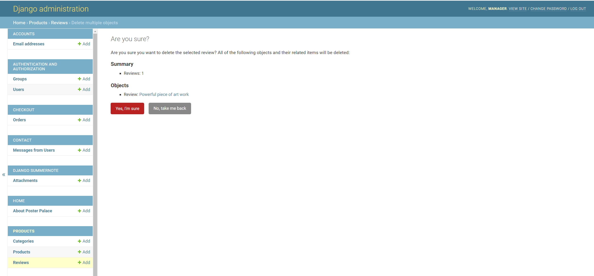

# Poster Palace Testing Information

This is the testing information for my project 5 eCommerce store Poster Palace


[DEPLOYED SITE IS HERE](https://posterpalace-a7414f135cf3.herokuapp.com/)  |  [ADMIN PANEL IS HERE](https://posterpalace-a7414f135cf3.herokuapp.com/admin)

[READ ME IS HERE](https://github.com/todiane/poster-palace)  |  [DEVELOPER: Diane Corriette](https://todiane.dev) - [LinkedIn](https://linkedin.com/in/todianedev)

<br>

## CONTENTS

[Features Testing](#features-testing)

[Admin Features](#admin-features)


[Store Features](#store-features)
- [Home Page Features](#home-page-features)
- [Navigation Bar Features](#navigation-bar-features)
- [Authentication Pages](#authentication-pages)
- [Products Page](#products-page)
- [Product Detail & Reviews](#product-detail-page)
- [Checkout Page](#checkout-page)
- [Profile Page](#profile-page)
- [Contact Us Page](#contact-us-page)
- [Wish List Page](#wish-list-page)
- [Newsletter Page](#newsletter-page)
- [Events Page](#events-page)
- [Compliance Pages](#compliance-pages)
- [Footer](#footer)

[UI Testing](#ui-testing)

[Browser Compatibility](#browser-compatibility)

[Responsiveness](#responsiveness)

[Code Validation](#code-validation)

- [CSS Validation](#css-validation)

- [JavaScript Validation](#javascript-validation)

- [HTML Validation](#html-validation)

<br>

[Lighthouse Validation](#lighthouse-validation)

- [index](#index-page)
- [registration](#registration-page )
- [login](#login-page)
- [forgotten password](#forgotten-password-page)
- [products page](#products-page-1)
- [checkout page](#checkout-page-1)
- [checkout success page](#checkout-success-page)
- [contact us page](#contact-us-page-1)
- [newsletter page](#newsletter-page-1)
- [event page](#event-page)

[Behaviour Driven Testing](#behaviour-driven-testing)

[Automated Testing](#automated-testing)

[Bugs](#bugs)

[Resources](#resources)

[Retrospective](#retrospective)

<br>

## Features Testing

A thorough manual testing process was undertaken to ensure all parts of the store worked as it should. Both the admin area and the main store were tested.

<details>

### Admin Features:

Manual tests were conducted in the admin area to ensure everything is working. There was an error when deleting orders and the necessary refactoring of code took place to remove that error. 

Admin Area - Role based access control successful - users are unable to log into the admin area

<br><br>

In the admin area products/categories/reviews can be added, edited and deleted. The following manual tests took place to ensure they all worked.

Reviews area:

<br><br>

Review selected and ready to delete - PASSED

<br><br>

Confirm deletion of review - PASSED

<br><br>

Success message to show review has been deleted - PASSED

<br><br>

Highlight orders to be deleted - PASSED

<br><br>

Confirmation of order deletion - PASSED

<br><br>

Adding new categories - PASSED
<br><br>

Adding new products - PASSED
<br><br>

**Emails via gmail:**
Emails are received (to the gmail account being used to send emails to customers) when a new order is placed. If an email is incorrect admin is also told about that too. These emails are just test@test.com emails used when testing checkout.

<br><br>

</details>

<p align="right">(<a href="#contents">back to top</a>)</p>

### Store Features

Tests have been undertaken to ensure the registration, email confirmation, confirming email, log-in, log out and password request all work.
Also tested has been the shopping journey from adding to wishlist, adding and removing products to shopping cart and checking out as an anonymous buyer as well as a registered buyer.
The process of adding a review has been tested for buyers and also for unregistered users.
This has all been documented on the [READ ME HERE](https://github.com/todiane/poster-palace)

<details>

Other manual tests have taken place. 

I went through the customer journey procedure myself and three other people tested the site and the checkout process as well as adding a review and using the wishlist. Below are the results


#### Home Page Features

|     |                 TEST                 |                            EXPECTED ACTION                                                                                                                              |     RESULT        |
| :-: | :----------------------------------: | :---------------------------------------------------------------------------------------------------------------------------------------------------------------------- | :-----------------|
| 01  |   Click navigation bar log           |                             User is redirected to the home page.          | Pass    |
| 02  |   Add term to search bar, e.g. abstract             |                               Products and images related to the term appear                                 | Pass    |
| 03  |   Click on My Account in navbar              |                              Menu dropdown with page options                                 | Pass    |
| 04  |   Click on shopping bag              |                        Taken to shopping bag page                               | Pass    |
| 05  |   Shop Now button clicked              |                        Taken to all products page                                               | Pass    |
| 06  |   Shop Now button clicked              |                        Taken to all products page                                               | Pass    |
| 07  |   Images under "Featured Products" clicked            |                        Taken to all product display page for that image                                             | Pass    |
| 08  |   Link in footer clicked           |                        Taken to approriate page on site and off site                                            | Pass    |


#### Navigation Bar Features


|     |                 TEST                 |                            EXPECTED ACTION                                                                                                                              |     RESULT        |
| :-: | :----------------------------------: | :---------------------------------------------------------------------------------------------------------------------------------------------------------------------- | :-----------------|
| 01  |   Click register page under MY Account logo       |                            Taken to page to sign up        | Pass    |
| 02  |   Click Contact Us link under My Account logo            |                   Taken to contact us form                                | Pass    |
| 03  |   Click on Login under My Account logo            |                              Taken to sign in page                             | Pass    |
| 04  |   Click on pages under MORE on navbar             |                        Taken to appropriate page                          | Pass    |
| 05  |   Click on SORT POSTERS menu in navbar              |                       Products are sorted in order selected e.g. a-z, z-a etc                                           | Pass    |
| 06  |   Click on category under Posters menu            |                        Taken to all appropriate category | Pass    |

#### Authentication Pages


|     |                 TEST                 |                            EXPECTED ACTION                                                                                                                              |     RESULT        |
| :-: | :----------------------------------: | :---------------------------------------------------------------------------------------------------------------------------------------------------------------------- | :-----------------|
| 01  |   Click on pages to register, login or logout      |                            Appropriate page is shown along with success message     | Pass    |
| 02  |   Click link for new password            |                   Taken to form to enter email and email sent out to user with password change link                               | Pass    |


#### Products Page


|     |                 TEST                 |                            EXPECTED ACTION                                                                                                                              |     RESULT        |
| :-: | :----------------------------------: | :---------------------------------------------------------------------------------------------------------------------------------------------------------------------- | :-----------------|
| 01  |   Visit products page      |                            All products show up     | Pass    |
| 02  |   Click on details button            |                   User taken to product display page | Pass    |
| 03  |   Click on 'Buy Now' button            |                   User adds product to their bag and success message is displayed.  | Pass    |

#### Product Detail Page


|     |                 TEST                 |                            EXPECTED ACTION                                                                                                                              |     RESULT        |
| :-: | :----------------------------------: | :---------------------------------------------------------------------------------------------------------------------------------------------------------------------- | :-----------------|
| 01  |   Visit product detail page      |                            All details are shown     | Pass    |
| 02  |   Click on specific product            |                   Taken to product display page | Pass    |
| 03  |   Click on add to wishlist           |                              Taken to signin if not registered or success message shows saying product added to wishlist                         | Pass    |
| 04  |   Click on quantity             |                        Quantity number is increased and decreased                         | Pass    |
| 05  |   Click on size             |                       Large or extra large size selected                                         | Pass    |
| 06  |   Add to cart without size             |                      User can not add the product without selecting a size                                       | Fail. Customers can add product. Needs further investigation.    |
| 07  |   Click on add review           |    Review can be added only if user is registered/logged in | Pass    |
| 08  |   Click add to cart           |    Product added to cart, success message shows to confirm                                         | Pass    |
| 09  |   Click go to secure checkout button          |                        Taken to checkout area                                            | Pass    |

#### Checkout Page

|     |                 TEST                 |                            EXPECTED ACTION                                                                                                                              |     RESULT        |
| :-: | :----------------------------------: | :---------------------------------------------------------------------------------------------------------------------------------------------------------------------- | :-----------------|
| 01  |   Order summary available    |                            Order summary appears with thumbnail product image | Pass    |
| 02  |   Cost of order is visible           |                   Order summary, total order, shipping and grand total all shown | Pass    |
| 03  |   Full personal details         |                              Form to take full customer details is visible. Any errors made are shown to user via messages                        | Pass    |
| 04  |   Credit card area visible            |       Area to add payment details is visible                       | Pass    |
| 05  |   Guest Checkout message            |          Message for guests to register for an account                                     | Pass    |
| 06  |   Adjust Bag Button          |    User can go back to bag - any details added are removed automatically | Pass    |
| 07  |   Complete order       |    Payment is taken and spinner appears                                         | Pass    |
| 08  |   Checkout Success          |                       Order summary appears on screen. Success message is shown. Email sent to customer. If logged in details saved to profile                                        | Pass    |

#### Profile Page


|     |                 TEST                 |                            EXPECTED ACTION                                                                                                                              |     RESULT        |
| :-: | :----------------------------------: | :---------------------------------------------------------------------------------------------------------------------------------------------------------------------- | :-----------------|
| 01  |   User registers    |                            Profile is created | Pass    |
| 02  |   User selects to save delivery details     |                   Delivery details and phone number shown on profile page | Pass    |
| 03  |   Orders saved to profile     |                 Past orders made by customers are available on their profile                     | Pass    |
| 04  |   Delivery details update           |      Delivery details can be updated in profile                     | Pass    |

#### Contact Us Page
|     |                 TEST                 |                            EXPECTED ACTION                                                                                                                              |     RESULT        |
| :-: | :----------------------------------: | :---------------------------------------------------------------------------------------------------------------------------------------------------------------------- | :-----------------|
| 01  |   User taken to contact us page via footer link  |                            Footer links work | Pass    |
| 02  |   User must select reason for contact    |                 Message shown if not selected                   | Pass    |
| 03  |   Email or username automatically added if registered          |      Email and user name added in Admin area | Pass    |
| 04  |   Thank you message       |    Thank you message appears after sending form. If user is registered their username and email appears in thank you message. If the user is not registered the username does not appear. | Pass    |
| 05  |   Offer button on page      |    User taken to clearance and deals categories                                | Pass    |


#### Wish List Page


|     |                 TEST                 |                            EXPECTED ACTION                                                                                                                              |     RESULT        |
| :-: | :----------------------------------: | :---------------------------------------------------------------------------------------------------------------------------------------------------------------------- | :-----------------|
| 01  |   Product Added to Wishlist    |                            Success message shows that item added | Pass    |
| 02  |   User visits wishlist         |                   Product shown with thumbnail image and description | Pass    |
| 03  |   Delete wish list item       |                              User can delete item. Success message shown that item will be deleted. Success message shows item has been removed.                     | Pass    |

#### Newsletter Page
|     |                 TEST                 |                            EXPECTED ACTION                                                                                                                              |     RESULT        |
| :-: | :----------------------------------: | :---------------------------------------------------------------------------------------------------------------------------------------------------------------------- | :-----------------|
| 01  |   User taken to newsletter page via footer link  |                            Footer links work | Pass    |
| 02  |   Register for newsletter     |                 User can sign up to newsletter via form on page                    | Pass    |
| 03  |   Register for newsletter           |      User can sign up to newsletter via pop out form on homepage                   | Pass    |
| 04  |   Thank you message       |    Thank you message appears after registering | Pass    |
| 05  |   Start shopping button on newsletter page      |    User taken to all products                                    | Pass    |


#### Events Page
|     |                 TEST                 |                            EXPECTED ACTION                                                                                                                              |     RESULT        |
| :-: | :----------------------------------: | :---------------------------------------------------------------------------------------------------------------------------------------------------------------------- | :-----------------|
| 01  |   User taken to events page via MORE menu in navbar   |                  Navbar link works | Pass    |
| 02  |   User can register for newsletter        |       Sign up form on events page works                                | Pass    |
| 03  |   Thank you message       |    Thank you message appears after registering | Pass    |
| 04  |   User can view pdf          |                     Link to PDF of winners opens in new window                                    | Pass    |
| 05  |   User can click on product images        |                     Product images take user to display page of relevant product                               | Pass    |


#### Compliance Pages

The links in the footer takes a user to the specific page as expected. This includes the shipping, terms & conditions, refund and privacy policy page - pass


#### Footer

All links lead to the correct pages. External links open in a new window.

</details>

## UI testing

Bootstrap is a responsive language so the mobile-first design approach has been taken care of for the most part, however, tests were performed to ensure the following:

| Test | Result | 
|:---|:---: |
| Toggle navbar doesn’t convert to navbar until over 990px |  PASS  |
| Search bar placeholder is always fully visible  |  PASS  |
| Size of social button icons respond as space increases |  PASS  |
| Product list scales from two columns to four at medium breakpoint  |  PASS  |
| Footer scales according to screen size |  PASS  |
| Search features remain visible on all screen sizes  |  PASS  |


## Browser Compatibility

Layout: The layout and appearance of the site has been tested for consistency throughout browsers. Browers tested include the main four:

- Chrome
- Firefox
- Safari
- Microsoft Edge

All links were tested and working. All pages load as expected and all features work as expected.

<p align="right">(<a href="#contents">back to top</a>)</p>

## Responsiveness

The eCommerce store looks and functions as intended on different browsers.

| Test | Screenshot View | 
|:---|:---: |
| 1700 px Desktop |   |
| Laptop  |     |
| iPad Air - Tablet |     |
| Mobile - Pixel 7  |    |

## Code Validation

I have been using linter and flake8 to test for code errors. Flake8 is installed and being used to ensure PEP8 python standard.

<details>

Using the command python -m flake8 I was given a list of changes that needed to be made. I changed most of what was suggested however there are a few lines that remain over 79 characters because it broke the code when I added it to another line. I will continue working on removing as many of them as I can but a few may remain after project submission.

<br><br>

I also used the Code Instiute [Python Linter](https://pep8ci.herokuapp.com/) to test the py files. Again, where lines of code were long and I didn't want to risk breaking the site by changing them e.g. see settings image below, I left the code intact.

Settings.py

<br><br>

Views.py - in main project

<br><br>

Url pages - all url pages were tested within ALL APPS and are without errors 

<br><br>

The following were tested within each app 

- Admin
- Forms
- Models
- Views - and all were without error. Code lines over the 79 characters were adjusted were possible and left if it caused additional errors to arise.

Also tested were any 

- context.py
- signal.py 

Even though using PEP8 and the CI Linter may seem like doubling up on work the linter did catch a few additional issues that using -m flak8 didn't, plus the CI linter is easier to work with rather than a long list of issues that need to be looked through.

<br><br>


Once I had completed the store I used the [Black code formatter](https://pypi.org/project/black/) to ensure the code is formatted correctly.

## CSS Validation

I used the CSS Validation service to test the site. I have been testing using the Heroku site and one error was found (added 2o0px instead of 200px) in the file and I corrected this and tested again in local.

<br><br>

</details>

## JavaScript Validation

All javascript was put through the [JSHINT tool](https://jshint.com/)

countryfield.js

<br><br>
stripe_elements.js

<br><br>


## HTML Validation

<details>

| Page | Validation Image | 
|:---|:---: |
| Base.html  |    |
| Index  |    |
| Main Navbar |    |
| Mobile Navbar |    |
| Register |   |
| Log In |   |
| Log Out |   |
| Product |     |
| Product Details |     |
| Checkout |    |
| Checkout Success |    |
| Profile |   |
| About Us |   |
| Contact Us |   |
| Contact Us Success |   |
| Contact Us FAQ|    |
| Events |    |
| Newsletter |   |
| Wish List |   |
| Choosing Poster Article |  |
| All Compliance Pages |  |
| Footer |    |

The newsletter and event pages contains errors because of the code provided by MailChimp for the newsletter, which I didn't want to tamper with so those errors remain.

The products page highlighted errors due to the sort selector, but nothing to do with the html code itself.

</details>


<p align="right">(<a href="#contents">back to top</a>)</p>

## Lighthouse Validation

The original lighthouse score for the index page was 80% so I had to add aria tags to my footer, add "defer" to some of the scripts in base.html, reduce the size of the images on the homepage plus save them as webp rather than png. The score increased to 90%. The remaining issue is the box at the top of the page with web content in it, which Lighthouse refers to as the "largest contentful paint". 

<details>

The scripts being in the header also caused lower scores and I added defer in some, defer in the Stripes linked caused it to stop working so I removed it.

***All pages scored 90% or above for accessibility.***

#### Index Page: 
Accessibility was given a score of 90% first time around because of a missing ```<ul>``` element in the mobile header. Once that was added the score increased to 100% but the navbar stopped working on larger screens so I removed it.

<br>

<br><br>

SEO was given a 100% score overall

<br><br>

#### Registration Page:

<br><br>

#### Login Page:

<br><br>

#### Forgotten Password Page:

<br><br>

#### Products Page:
PNG images reduced score and can be changed to webp
Test results the same across all pages e.g. sort category price high to low, a-z, z-a, low to high price.

<br><br>

#### Checkout Page:

<br><br>

#### Checkout Success Page:

<br><br>

#### Profile Page:

<br><br>

#### About Page:

<br><br>

#### Contact Us Page:

<br><br>

#### Newsletter Page:

<br><br>

#### Event Page:

<br><br>

</details>

## Behaviour Driven Testing

Behaviour driven tests have been carried out based on user stories and using the Gerkin format. The behaviour of each story was tested to ensure the 'Scenario', 'Given', 'When' 'Then' and 'And' aspects of testing work correctly. For example:

<details>

**Behaviour Driven Test**

**SCENARIO:** "As a buyer I receive email confirmation after purchase"

Given: That a user has purchased a product

And: Their email has been received and is correct

When: The sale goes through

Then: The system will automatically generate an email

And: It will be sent to the buyer as confirmation of their purchase

The behaviour driven tests have been included inside each user story on the [GitHub Project Page](https://github.com/users/todiane/projects/10/views/1)


</details>

## Automated Testing

I had originally set up a number of tests (as you can see from my commits) but wasn't sure if they were correct so deleted them.
Tests have been written, and added to the tests folder, for models, views, and urls. 

<details>

I have set up the database in the settings file so that I can change from the production database to the development database (DEVELOPMENT_DB) during testing. The development database is free of products/users and so can be used to test as if the project is just beginning.


The Django built-in unit testing framework was used to test the applications functionality.

In order to run the tests, I ran the following command:

```
python3 manage.py test
```

To create the coverage report, I  first installed coverage

```
pip install coverage

```

Then I was able to run any of the following commands:

```

coverage run manage.py test

coverage run --source=name-of-app manage.py test

coverage report

```

To see the HTML version of the reports, and find out whether some pieces of code were missing, I ran the following command:

```

coverage html - generates the htmlcov/index.html file to view the report

python -m http.server

```

The following files were added to gitignore

```
.coverage
htmlcov/

```

TestCase was used to test models and views. As there is no database needed for tessting urls SimpleTestCase was used.

Below are the results from my coverage report:

<br><br>

</details>

## Bugs

<details>

- When saving a product to the wishlist you can not select a size. If you select XL size an error occurs. Doesn’t always happen on heroku, but size isn't an option for the wishlist, just the product. 

- Another size issue is making a size a required field. I have tried to change the size model (as per my commits) in different ways so that a size must be selected but I wasn't able to get it to work, despite help from tutor support. I didn't want to change the model too many times in case the database ended up corrupted, so it is possible to add a product without selecting a size and the order will still go through. I could have added javascript to validate the size and bring up an error if a size wasn't selected but that only really changes the client side validation and I want to be able to add server side validation. This is something I am focused on learning how to achieve so I can update the site at some point.

- When writing a review the star rating is required as a minimum. A buyer cannot add a review without it. If they complete the title and review box but do not select a star rating nothing happens. I have tried to include an error message to let them know if the star rating is not selected but despite using different code (and help from tutor support) the error message does not display.

- Phone number area on checkout form let me put in letters. It should be numbers only and an attempt was made to change that but this broke the checkout process. Further investigation into making it work is needed.

- Creating a sticky footer. Despite trying I have been unable to create a sticky footer and discovering how to include this in Django is something I need to learn.

- There is an error message in the browser after checkout

```Uncaught (in promise) Error: Could not establish connection. Receiving end does not exist.```

However, I placed an order and it went through to Stripe

<br><br>

<br><br>


- when you write a review selecting a star rating is required however no error message appears if you do not select stars. I have attempted to add it using the following as shown at [Geeksforgeeks](https://www.geeksforgeeks.org/error_messages-django-form-field-validation/)

```
class Meta:
        model = Reviews
        fields = ['subject', 'rating', 'review']
        error_messages = {
            'rating': {
                'required': "Please select a rating."  # Custom error message for the required field
            }
        }
```
and to override the __init__ method of the form and set the required attribute for the "rating" field to True. Neither worked. The review won't submit without the rating but no indication as to why shows up for the user, which is not UI friendly.

```
class ReviewForm(forms.ModelForm):
    def __init__(self, *args, **kwargs):
        super(ReviewForm, self).__init__(*args, **kwargs)
        self.fields['rating'].required = True
        self.fields['rating'].error_messages = {'required': 'Please select a rating'}

    class Meta:
        model = Reviews
        fields = ["subject", "review", "rating"]

```

</details>

## Resources

- [Pep 8 for code standards](https://peps.python.org/pep-0008/)
- [Black code formatter](https://pypi.org/project/black/)
- [Code Institute Python Tool](https://pep8ci.herokuapp.com/)
- [JSHINT tool](https://jshint.com/)
- [HTML validator](https://validator.w3.org/nu/#textarea)
- [CSS validator](https://jigsaw.w3.org/css-validator/)
- [Google Lighthouse](https://chromewebstore.google.com/detail/lighthouse/blipmdconlkpinefehnmjammfjpmpbjk)
- [TestCase](https://docs.djangoproject.com/en/4.2/topics/testing/tools/#testcase)
- [Django Testing](https://developer.mozilla.org/en-US/docs/Learn/Server-side/Django/Testing)
- [Mastering Django Unit Testing](https://www.youtube.com/watch?v=N_HLNV2UQjg)

## Retrospective

Manual testing is a straight forward process that I have performed many times and find easy to complete. After completing the project I decided to learn more about automated testing. 

<details>

I still struggle to understand the concept a little and went over the CI training material again. Going back to the Javascript training and watching the Testing Paradigms video reminded me about behaviour driven testing, which I added to my project. In the same video it mentioned that testing can be carried out after the creation of code which is why I decided to add automated testing to my project. 

Separating the database and using the development database that had none of the current content/information made it similar to starting from zero and adding testing.

The training suggested that tests can be carried out in a folder or under each individual app. I opted to put the tests in a folder but adding all the views became a little confusing so in the future I will add tests within their own app.

I still have some work to do to really appreciate the value of test driven data and will continue learning about this area of coding. 

With so many different testing options available to save confusion I need to decide on a testing framework and focus on learning that until I understand how it works.

</details>

<p align="right">(<a href="#contents">back to top</a>)</p>
